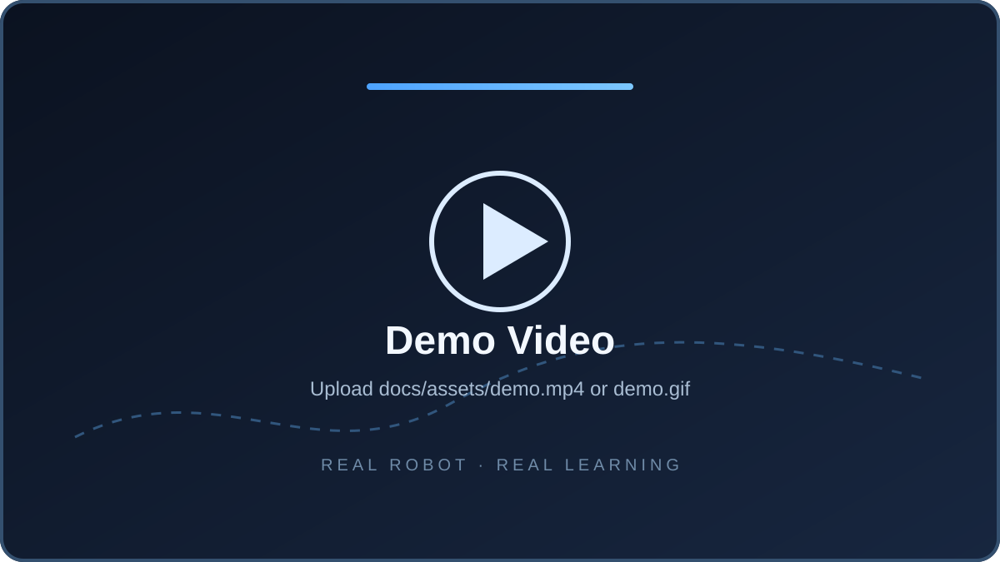
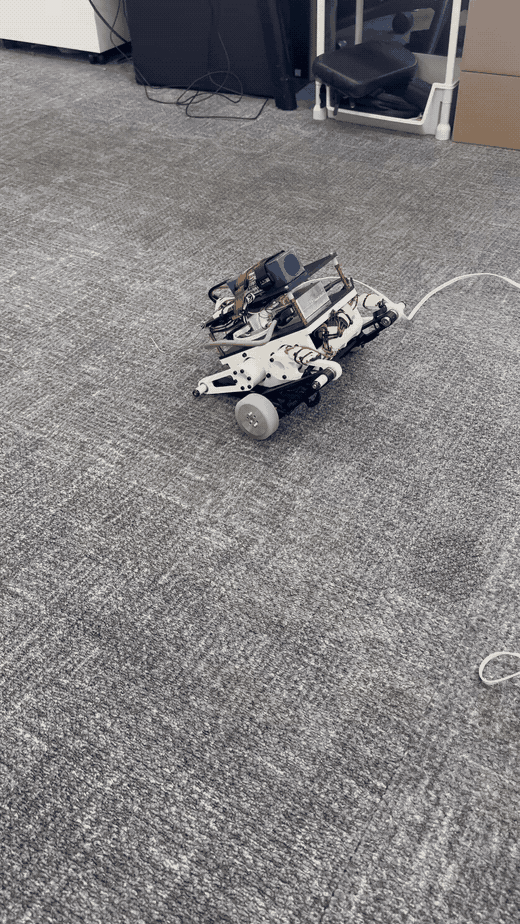
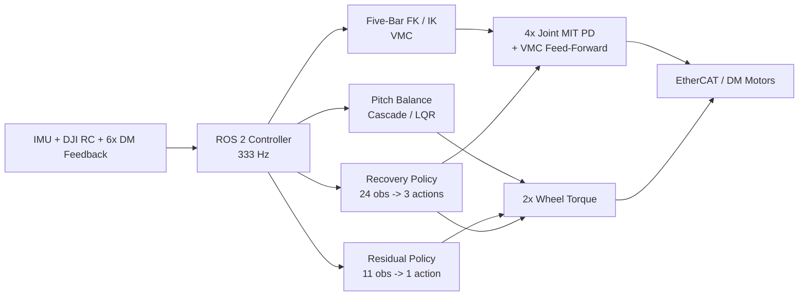

<div align="center">

# Reinforcement Learning Wheel-Legged Robot

**Micro_to_Macro — Sim-to-Real control for a self-balancing wheel-legged robot**

<p>
  
  
  
  
  
</p>


</div>

## Overview

`Micro_to_Macro` is a ROS 2 Humble control workspace for a **wheel-legged self-balancing robot**, developed around a hybrid control stack that combines model-based control with reinforcement learning.

The controller integrates **five-bar kinematics, VMC, wheel-balance control, yaw/roll/height control, an ONNX residual policy, and an ONNX recovery policy** for deployment on real hardware through ROS 2 and EtherCAT.

### Highlights

| Module | Role |
|---|---|
| **Residual RL** | Adds a learned wheel-torque residual on top of the classical balance controller. |
| **Recovery Policy** | Recovers from difficult initial poses before handing control to the normal balancing stack. |
| **VMC + Five-Bar IK/FK** | Controls wheel-centre position, leg support force, and joint torque feed-forward. |
| **Cascade / LQR Balance** | Stabilizes pitch and regulates wheel position / velocity. |
| **Roll / Yaw / Height** | Roll via left-right leg-height difference, yaw via wheel differential torque, height via virtual-leg target. |
| **ROS 2 + EtherCAT** | Connects IMU, DJI RC and six DM motors to the real-time hardware interface. |

## Demo

<div align="center">
  
</div>

<!--
VIDEO SLOT
1. Upload a real-robot video to: docs/assets/demo.mp4
2. To make the placeholder clickable, replace the  block above with:

<a href="docs/assets/demo.mp4">
  
</a>

Optional: for inline playback-like preview on GitHub, export a short GIF to
`docs/assets/demo.gif` and replace the placeholder with:


-->

## Control Architecture



### Normal balancing

```text
Five-bar IK/FK + VMC
          |
          +--> 4 leg motors: MIT position PD + VMC torque feed-forward

Pitch / position / velocity
          |
          +--> Cascade or LQR baseline
                     +
                 Residual RL
                     +
              Yaw differential torque
                     |
                     +--> 2 wheel motors: torque control
```

### Recovery handoff

```text
DISARMED --> RECOVERY --> NORMAL
               |            |
        recovery_policy   Cascade/LQR
        wheel torque      + residual RL
        leg height        + VMC
        leg angle
```

The recovery controller transfers wheel torque and joint targets back to the normal controller using a smooth handoff rather than an abrupt mode switch.

## Repository Layout

```text
Micro_to_Macro/
├── README.md
├── ROLL_CONTROL_README_CN.md
└── src/
    └── mujoco_micro/
        ├── config/                 # Controller and hardware parameters
        ├── include/mujoco_micro/   # Core interfaces
        ├── models/                 # policy.onnx / recovery_policy.onnx
        ├── launch/                 # ROS 2 launch files
        ├── scripts/                # Debug and gain-generation utilities
        ├── src/
        │   ├── mujoco_micro_node.cpp
        │   ├── control_core.cpp
        │   ├── kinematics.cpp
        │   └── policy_runner.cpp
        └── tools/                  # Core self-check utilities
```

## Hardware / ROS 2 Interface

The controller expects the EtherCAT workspace to provide `custom_msgs` and the robot I/O topics.

| Signal | Topic |
|---|---|
| IMU | `/ecat/sn1966149/app1/read` |
| DJI RC | `/ecat/sn2228252/app1/read` |
| Left joint A | `/ecat/sn2228252/app2/read` / `write` |
| Left joint B | `/ecat/sn2228252/app3/read` / `write` |
| Left wheel | `/ecat/sn2228252/app4/read` / `write` |
| Right joint A | `/ecat/sn2228252/app5/read` / `write` |
| Right joint B | `/ecat/sn2228252/app6/read` / `write` |
| Right wheel | `/ecat/sn2228252/app7/read` / `write` |
| Debug | `/vmc/debug` |

## Quick Start

### 1. Dependencies

```bash
sudo apt install libopencv-dev
source /opt/ros/humble/setup.bash
source ~/foot_ws/install/setup.bash
```

The overlaid `foot_ws` workspace must provide the EtherCAT interface and `custom_msgs`.

### 2. Build

```bash
git clone https://github.com/ssybh2/Micro_to_Macro.git ~/mujoco_micro
cd ~/mujoco_micro
colcon build --symlink-install --packages-select mujoco_micro
source install/setup.bash
```

### 3. First run — motor output disabled

```bash
ros2 launch mujoco_micro mujoco_micro.launch.py dry_run:=true
```

Monitor the controller state with:

```bash
ros2 run mujoco_micro mujoco_micro_debug_monitor.py
```

### 4. Real robot

Only after checking IMU orientation, motor directions, joint zero positions, five-bar geometry and `/vmc/debug`:

```bash
ros2 launch mujoco_micro mujoco_micro.launch.py dry_run:=false
```

Useful launch overrides:

```bash
# Classical controller only
ros2 launch mujoco_micro mujoco_micro.launch.py \
  dry_run:=false policy_enable:=false recovery_enable:=false

# Residual RL enabled, recovery disabled
ros2 launch mujoco_micro mujoco_micro.launch.py \
  dry_run:=false policy_enable:=true recovery_enable:=false
```

## RC Mapping

| DJI RC input | Function |
|---|---|
| `right_y` | Forward / backward target velocity |
| `left_x` | Target yaw rate |
| `right_x` | Target roll angle |
| `left_y` | Robot height |
| Right switch `1` | Reset / calibration |
| Right switch `2` | Disable all motors |
| Right switch `3` | Arm / enter recovery or normal control |

## Safety

> **Real-hardware research prototype.** Always perform the first test with the robot mechanically supported and `dry_run:=true`. Verify IMU axes, encoder signs, joint calibration, torque limits and emergency-disable behavior before enabling motor output.

The controller includes timeout checks, motor fault detection, five-bar singularity checks, pitch/roll fall cutoffs, joint-error limits, recovery bounds and automatic motor disable on invalid input.

## Documentation

- Detailed package documentation: [`src/mujoco_micro/README.md`](src/mujoco_micro/README.md)
- Roll controller notes: [`ROLL_CONTROL_README_CN.md`](ROLL_CONTROL_README_CN.md)
- Main parameters: [`src/mujoco_micro/config/mujoco_micro.yaml`](src/mujoco_micro/config/mujoco_micro.yaml)

---

<div align="center">
  <sub>Robotics · Reinforcement Learning · Sim-to-Real · Wheel-Legged Control</sub>
</div>
