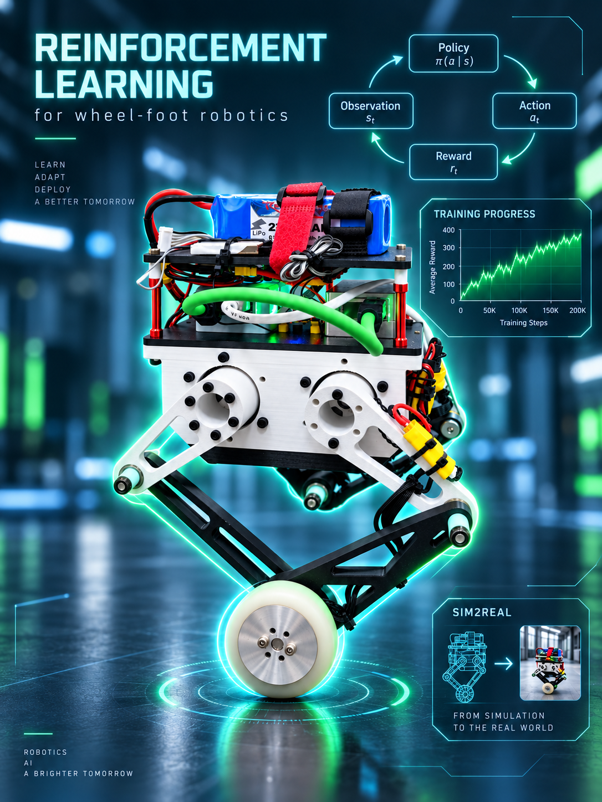

<div align="center">

# Reinforcement Learning Wheel-Legged Robot

**Micro_to_Macro — Sim-to-Real control for a self-balancing wheel-legged robot**

<p>
  
  
  
  
  
</p>



</div>

## Overview

`Micro_to_Macro` is a ROS 2 Humble control workspace for a **wheel-legged self-balancing robot**, developed around a hybrid control stack that combines model-based control with reinforcement learning.

The controller integrates **five-bar kinematics, VMC, wheel-balance control, yaw/roll/height control, an ONNX residual policy, and an ONNX recovery policy** for deployment on real hardware through ROS 2 and EtherCAT.

## Demo

<div align="center">
  
  <br>
  <sub>Auto-playing real-robot preview · generated automatically from the source video</sub>
</div>


## Quick Start

### 1. Dependencies

```bash
sudo apt install libopencv-dev
source /opt/ros/humble/setup.bash
source ~/foot_ws/install/setup.bash
```

The overlaid `foot_ws` workspace must provide the EtherCAT interface and `custom_msgs`.

### 2. Build

```bash
git clone https://github.com/ssybh2/Micro_to_Macro.git ~/mujoco_micro
cd ~/mujoco_micro
colcon build --symlink-install --packages-select mujoco_micro
source install/setup.bash
```

### 3. First run — motor output disabled

```bash
ros2 launch mujoco_micro mujoco_micro.launch.py dry_run:=true
```

Monitor the controller state with:

```bash
ros2 run mujoco_micro mujoco_micro_debug_monitor.py
```


## Documentation

- Detailed package documentation: [`src/mujoco_micro/README.md`](src/mujoco_micro/README.md)
- Roll controller notes: [`ROLL_CONTROL_README_CN.md`](ROLL_CONTROL_README_CN.md)
- Main parameters: [`src/mujoco_micro/config/mujoco_micro.yaml`](src/mujoco_micro/config/mujoco_micro.yaml)

---

<div align="center">
  <sub>Robotics · Reinforcement Learning · Sim-to-Real · Wheel-Legged Control</sub>
</div>
